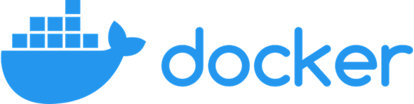
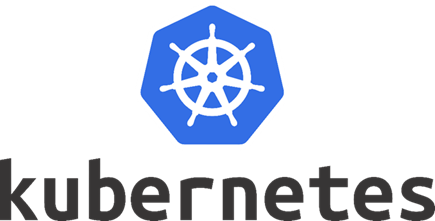
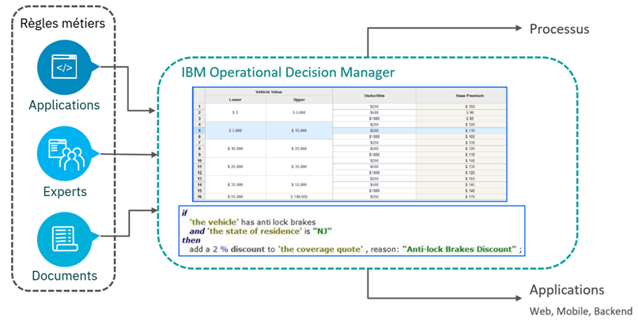
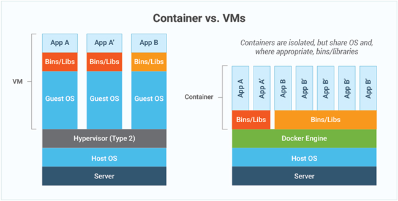
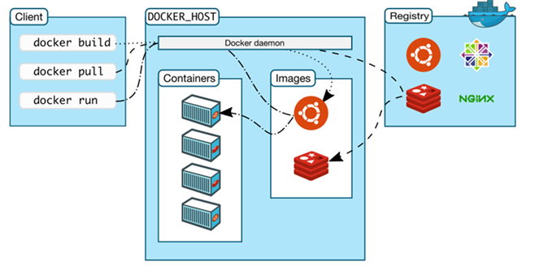

# Module 1 : Introduction à la Conteneurisation
## Cours Docker et Kubernetes pour Ingénieurs en Électronique
### Durée : 45 minutes

---

## Slide 1 : Bienvenue 👋

### Formation Docker et Kubernetes
**Pour Ingénieurs en Électronique - Polytech**

<div style="text-align: center; margin: 30px 0;">
  
  
</div>

- Durée : 4 heures
- Format : Théorie + Pratique intensive
- Objectif : Maîtriser la conteneurisation et l'orchestration

---

## Slide 2 : Vos formateurs 🎓

### Laurent Grateau & Nicolas Peulvast

<div style="display: flex; justify-content: center; gap: 50px; margin: 20px 0;">
  <div style="text-align: center;">
    
    <p><strong>Laurent Grateau</strong></p>
  </div>
  <div style="text-align: center;">
    
    <p><strong>Nicolas Peulvast</strong></p>
  </div>
</div>

**IBM France Lab - Saclay & Sophia Antipolis**
- R&D IBM en France
- 300 développeurs spécialisés
- Expertise en automatisation de la décision et Intelligence Artificielle
- Utilisateurs quotidiens de Docker et Kubernetes en production

**Laurent Grateau**
- Tech Lead Cloud
- Performance Architect
- laurent.grateau@fr.ibm.com

**Nicolas Peulvast**
- Senior Software Developer
- peulvast@fr.ibm.com

---

## Slide 3 : Contexte - IBM ODM 🔧

### Qu'est-ce qu'ODM (Operational Decision Manager) ?

**Plateforme de gestion de règles métier**



**Cas d'usage :**
- Approbation de prêts bancaires
- Détection de fraudes
- Traitement des demandes de remboursements
- Recommandations d'actions client dans le respect d'une stratégie d'entreprise

**Pourquoi Docker/Kubernetes ?**
- Déploiement simplifié
- Scalabilité automatique
- Haute disponibilité
- Gestion multi-environnements

---

## Slide 4 : Agenda du cours 📅

### Programme de la journée

1. **Présentation et Introduction** (15 min)
2. **La conteneurisation** (30 min)
3. **Première partie - Travaux Pratiques Docker** (60 min)
4. **Pause** (15 min)
5. **Seconde partie - Travaux Pratiques Docker Avancé** (60 min)
6. **Pause** (15 min)
7. **Troisième partie - Kubernetes** (60 min)
8. **Conclusion** (15 min)

---

## Slide 5 : La Conteneurisation 📦

### Qu'est-ce qu'un conteneur ?

<div style="text-align: center; margin: 20px 0;">
  
</div>

**Définition :**
Un conteneur est une unité logicielle standardisée qui empaquette le code et toutes ses dépendances pour que l'application s'exécute rapidement et de manière fiable d'un environnement informatique à un autre.

**Analogie :**
Comme un conteneur maritime qui standardise le transport de marchandises, un conteneur logiciel standardise le déploiement d'applications.

---

## Slide 6 : Why Docker ? 🐳

### Docker : La plateforme de conteneurisation

<div style="text-align: center; margin: 20px 0;">
  
</div>

**Docker est une technologie basée sur les conteneurs qui :**
- Automatise le déploiement d'applications dans des conteneurs logiciels
- Fournit une couche d'abstraction et d'automatisation de la virtualisation au niveau du système d'exploitation sur Linux
- Est une plateforme ouverte pour les développeurs et administrateurs système pour construire, expédier et exécuter des applications distribuées

**Caractéristiques clés :**
- Open source
- Portable
- Léger
- Isolé

---

## Slide 7 : Avantages de Docker 🚀

### Pourquoi utiliser Docker ?

**1. Construire n'importe quelle application dans n'importe quel langage**
- Support de tous les langages et frameworks
- Utilisation de n'importe quelle stack technologique

**2. Les applications Dockerisées peuvent s'exécuter n'importe où**
- Sur site (on-premises)
- Sur plusieurs clouds (AWS, Azure, GCP)
- Environnements hybrides

**3. Unir les développeurs et les administrateurs système**
- Résout les problèmes de dépendances
- "Ça marche sur ma machine" → "Ça marche partout"

**4. Adoption massive**
- 30% des hôtes exécutent Docker (et en augmentation)
- Format central pour la majorité des clouds publics et privés

---

## Slide 8 : DevOps - C'est quoi ce truc ? 🔄

### Culture DevOps

**DevOps = Development + Operations**

**Objectifs :**
- Réduire le temps entre l'écriture du code et sa mise en production
- Améliorer la collaboration entre équipes
- Automatiser les processus
- Livraison continue (CI/CD)

**Docker dans DevOps :**
- Environnements cohérents (dev, test, prod)
- Déploiements rapides et fiables
- Rollback facile en cas de problème
- Infrastructure as Code

```
Développeur → Build → Test → Deploy → Production
    ↓          ↓       ↓       ↓         ↓
  Docker    Docker  Docker  Docker   Docker
```

---

## Slide 9 : Container vs VM 🆚

### Comparaison : Conteneurs vs Machines Virtuelles

<div style="text-align: center; margin: 30px 0;">
  
</div>

**Avantages des conteneurs :**
- ✅ Meilleure utilisation des ressources (moins d'overhead) : CPU, RAM
- ✅ Plus rapide à démarrer/arrêter (secondes vs minutes)
- ✅ Portabilité puissante
- ✅ Plusieurs applications sur le même hôte
- ✅ Abstraction du système

**Points clés :**
- Les conteneurs partagent le même OS et sont isolés au niveau processus
- Les VMs incluent un OS complet pour chaque instance
- Les conteneurs sont plus légers et démarrent plus rapidement

---

## Slide 10 : Architecture Docker 🏗️

### Composants de Docker

<div style="text-align: center; margin: 30px 0;">
  
</div>

**1. Docker Client (CLI)**
- Interface en ligne de commande
- Communique avec le daemon via API REST
- Commandes : `docker build`, `docker pull`, `docker run`, etc.

**2. Docker Daemon (Serveur)**
- Service qui s'exécute en arrière-plan sur le Docker Host
- Gère les conteneurs, images, réseaux, volumes
- API REST pour la communication

**3. Docker Registry (Registre d'images)**
- Dépôt d'images Docker (Docker Hub, registres privés)
- Stocke les images Ubuntu, Redis, NGINX, etc.
- Le daemon pull/push les images depuis/vers le registry

**4. Docker Compose**
- Outil d'orchestration
- Définition d'applications multi-conteneurs
- Fichier YAML de configuration

---

## Slide 11 : Images et Conteneurs 🖼️

### Concepts fondamentaux

**Image Docker**
Une image est un package léger, autonome et exécutable qui inclut tout le nécessaire pour exécuter un logiciel :
- Le système d'exploitation (OS)
- L'exécutable de l'application
- Toutes les dépendances
- Les bibliothèques
- Les variables d'environnement

**Construction :**
- Construite avec des instructions depuis un `Dockerfile`
- Immuable (read-only)
- Peut être partagée via un registre

**Conteneur Docker**
Un conteneur est une instance d'exécution d'une image - ce que l'image devient en mémoire lorsqu'elle est réellement exécutée :
- Exécute les applications nativement sur le noyau de la machine hôte
- S'exécute dans un processus discret (environnement isolé)
- Les conteneurs sur la même machine partagent un seul noyau

**Analogie :**
- **Image** = Classe (en programmation orientée objet)
- **Conteneur** = Instance de la classe

---

## Slide 12 : Récapitulatif - Concepts Clés 📝

### Points essentiels à retenir

**Conteneurisation :**
- Empaquetage d'applications avec leurs dépendances
- Isolation et portabilité
- Léger et rapide

**Docker :**
- Plateforme de conteneurisation leader
- Simplifie le développement et le déploiement
- Écosystème riche (Docker Hub, Docker Compose)

**Avantages :**
- Cohérence entre environnements
- Déploiement rapide
- Utilisation efficace des ressources
- Facilite DevOps et CI/CD

**Prochaine étape :**
Travaux pratiques - Installation et premières commandes Docker !

---

## Slide 13 : Questions ? 🙋

### Discussion

**Points à clarifier ?**
- Concepts pas clairs ?
- Questions sur les cas d'usage ?
- Différences conteneurs vs VMs ?

**Prochaine étape :**
Installation de Docker et premiers exercices pratiques

---

## Notes pour le formateur 👨‍🏫

### Timing suggéré
- Slides 1-4 : Introduction et contexte (10 min)
- Slides 5-9 : Concepts de conteneurisation (20 min)
- Slides 10-11 : Architecture Docker (10 min)
- Slide 12-13 : Récapitulatif et questions (5 min)

### Points d'attention
- Vérifier que tous les étudiants comprennent la différence conteneur/VM
- Utiliser des analogies concrètes
- Préparer des exemples visuels
- S'assurer que Docker est installé avant les TP

### Matériel nécessaire
- Projecteur
- Accès Internet
- Docker Desktop installé sur les machines
- Compte Docker Hub créé
