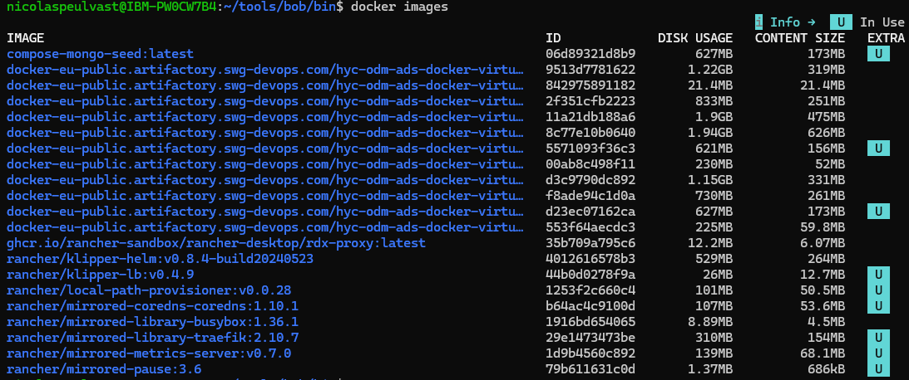

# Module 2 : Docker - Commandes Essentielles
## Cours Docker et Kubernetes pour Ingénieurs en Électronique
### Durée : 60 minutes

---

## Slide 1 : Module 2 - Commandes Docker 🐳

### Objectifs du module

**Ce que vous allez apprendre :**
- Installation et configuration de Docker
- Rechercher et télécharger des images
- Lancer et gérer des conteneurs
- Commandes essentielles du quotidien
- Exercices pratiques

**Format :**
- 20 min : Théorie et démonstrations
- 40 min : Travaux pratiques guidés

---

## Slide 2 : Installation de Docker 💻

### Créer un compte Docker Hub

**Étape 1 : Inscription**
- Aller sur https://hub.docker.com/
- Se connecter avec GitHub ou créer un compte email
- Gratuit pour les dépôts publics

**Étape 2 : Installation de Docker**

**Windows 10/11 :**
- Docker Desktop : https://docs.docker.com/desktop/install/windows-install/
- Nécessite WSL 2 (Windows Subsystem for Linux)

**macOS :**
- Docker Desktop : https://docs.docker.com/desktop/install/mac-install/
- Support Apple Silicon (M1/M2) et Intel

**Linux :**
- Docker Engine : https://docs.docker.com/engine/install/
- Varie selon la distribution

**Alternative : Play with Docker**
- http://labs.play-with-docker.com
- Environnement Docker dans le navigateur
- Parfait pour tester sans installation

---

## Slide 3 : Vérification de l'installation ✅

### Tester Docker

```bash
# Vérifier la version de Docker
docker --version
# Exemple sortie possible : Docker version 29.0.2-rd, build 5a2d7eb

# Vérifier que Docker fonctionne
docker run hello-world

# Afficher les informations système
docker info

# Voir l'aide
docker --help
```

**Si tout fonctionne, vous êtes prêt ! 🎉**

---

## Slide 4 : Exercice 1 - Docker Basics 🔍

### Rechercher des images

**Dans un navigateur web :**
1. Aller sur https://hub.docker.com/
2. Taper `wordpress` dans la barre de recherche
3. Sélectionner l'image officielle
4. Explorer les informations :
   - Versions disponibles (tags)
   - Documentation d'utilisation
   - Nombre de téléchargements
   - Dernière mise à jour

**En ligne de commande :**

```bash
# Rechercher une image sur Docker Hub
docker search wordpress

# Sortie :
# NAME                DESCRIPTION                                     STARS     OFFICIAL
# wordpress           The WordPress rich content management system    5687      [OK]
# wordpress/cli       A CLI for WordPress                             89        
```

**Commande `docker search` :**
- Recherche dans Docker Hub
- Affiche les images publiques
- Trie par popularité (STARS)
- Indique les images officielles

---

## Slide 5 : Télécharger une image 📥

### Commande `docker pull`

**Syntaxe :**
```bash
docker pull [OPTIONS] NAME[:TAG]
```

**Exemples :**

```bash
# Télécharger la dernière version de WordPress
docker pull wordpress

# Télécharger une version spécifique
docker pull wordpress:6.4

# Télécharger depuis un registre privé
docker pull myregistry.com/myimage:v1.0
```

**Que se passe-t-il ?**
1. Docker contacte le registre (Docker Hub par défaut)
2. Télécharge les couches (layers) de l'image
3. Stocke l'image localement
4. Vérifie l'intégrité (checksum)

**Tags importants :**
- `latest` : dernière version (par défaut)
- `alpine` : version minimale basée sur Alpine Linux
- `X.Y.Z` : version spécifique

---

## Slide 6 : Lister les images 📋

### Commande `docker images`

**Voir les images locales :**

```bash
# Lister toutes les images
docker images

# Sortie :
# REPOSITORY    TAG       IMAGE ID       CREATED        SIZE
# wordpress     latest    4c9b15c9a8ae   4 weeks ago    697MB
# nginx         alpine    a64a6e03b055   2 weeks ago    23.5MB
# mysql         8.0       3218b38490ce   3 weeks ago    516MB
```
**Colonnes expliquées :**
- **REPOSITORY** : Nom de l'image
- **TAG** : Version/variante
- **IMAGE ID** : Identifiant unique (hash)
- **CREATED** : Date de création
- **SIZE** : Taille de l'image
- **In Use** : Indique si l'image est utilisée par un conteneur (nouvelle version)

**Nouvelle version avec couleurs et informations d'utilisation :**

<div style="text-align: center; margin: 20px 0;">
  
</div>

**Autres commandes utiles :**
```bash
# Filtrer les images
docker images wordpress

# Format personnalisé
docker images --format "table {{.Repository}}\t{{.Tag}}\t{{.Size}}"

# Voir toutes les images (y compris intermédiaires)
docker images -a
```

---

## Slide 7 : Lancer un conteneur 🚀

### Commande `docker container run`

**Syntaxe de base :**
```bash
docker container run [OPTIONS] IMAGE [COMMAND]
```

**Exemple WordPress :**
```bash
docker container run --name some-wordpress -p 8080:80 -d wordpress
```

**Options importantes :**

| Option | Description | Exemple |
|--------|-------------|---------|
| `--name` | Nom du conteneur | `--name mon-app` |
| `-d` | Mode détaché (background) | `-d` |
| `-p` | Mapping de ports | `-p 8080:80` |
| `-e` | Variables d'environnement | `-e DB_PASSWORD=secret` |
| `-v` | Volumes (persistance) | `-v /data:/app/data` |
| `--rm` | Supprimer après arrêt | `--rm` |
| `-it` | Mode interactif | `-it` |

**Explication du mapping de ports :**
```
-p 8080:80
   │    │
   │    └─ Port dans le conteneur
   └────── Port sur l'hôte
```

**Accès à l'application :**
- http://localhost:8080
- ou http://adresse-ip-hote:8080

---

## Slide 8 : Exécuter des commandes dans un conteneur 🔧

### Commande `docker container exec`

**Syntaxe :**
```bash
docker container exec [OPTIONS] CONTAINER COMMAND [ARG...]
```

**Exemples pratiques :**

```bash
# Exécuter une commande simple
docker container exec -ti some-wordpress echo "Hello from container!"
# Sortie : Hello from container!

# Ouvrir un shell bash dans le conteneur
docker container exec -ti some-wordpress bash

# Une fois dans le conteneur :
root@5996767b0f58:/var/www/html# ls
license.txt  wp-activate.php  wp-blog-header.php  ...

root@5996767b0f58:/var/www/html# pwd
/var/www/html

root@5996767b0f58:/var/www/html# exit
```

**Options :**
- `-t` : Alloue un pseudo-TTY (terminal)
- `-i` : Mode interactif (STDIN ouvert)
- `-ti` ou `-it` : Combinaison des deux

**Cas d'usage :**
- Déboguer une application
- Inspecter les fichiers
- Exécuter des scripts de maintenance
- Vérifier les logs internes

---

## Slide 9 : Lister les conteneurs 📊

### Commande `docker container ps`

**Voir les conteneurs en cours d'exécution :**

```bash
docker container ps

# Sortie :
# CONTAINER ID   IMAGE       COMMAND                  PORTS                  NAMES
# 80b45fb18d33   wordpress   "docker-entrypoint.s…"   0.0.0.0:8080->80/tcp   some-wordpress
```

**Voir tous les conteneurs (même arrêtés) :**
```bash
docker container ps -a
```

**Informations affichées :**
- **CONTAINER ID** : Identifiant court
- **IMAGE** : Image utilisée
- **COMMAND** : Commande exécutée
- **CREATED** : Date de création
- **STATUS** : État (Up, Exited)
- **PORTS** : Ports exposés
- **NAMES** : Nom du conteneur

**Filtres utiles :**
```bash
# Conteneurs basés sur une image
docker ps --filter "ancestor=wordpress"

# Conteneurs avec un statut spécifique
docker ps -a --filter "status=exited"

# Format personnalisé
docker ps --format "table {{.Names}}\t{{.Status}}\t{{.Ports}}"
```

---

## Slide 10 : Gérer les conteneurs ⚙️

### Arrêter, démarrer, redémarrer

**Arrêter un conteneur :**
```bash
docker container stop some-wordpress
# Envoie SIGTERM puis SIGKILL après 10s
```

**Démarrer un conteneur arrêté :**
```bash
docker container start some-wordpress
```

**Redémarrer un conteneur :**
```bash
docker container restart some-wordpress
```

**Mettre en pause / reprendre :**
```bash
docker container pause some-wordpress
docker container unpause some-wordpress
```

**Différence stop vs kill :**
```bash
# Arrêt gracieux (recommandé)
docker container stop some-wordpress

# Arrêt forcé immédiat
docker container kill some-wordpress
```

---

## Slide 11 : Consulter les logs 📜

### Commande `docker container logs`

**Voir les logs d'un conteneur :**

```bash
docker container logs some-wordpress

# Sortie :
# WordPress not found in /var/www/html - copying now...
# Complete! WordPress has been successfully copied to /var/www/html
# AH00558: apache2: Could not reliably determine the server's fully qualified ...
```

**Options utiles :**

```bash
# Suivre les logs en temps réel (comme tail -f)
docker container logs -f some-wordpress

# Afficher les 50 dernières lignes
docker container logs --tail 50 some-wordpress

# Afficher avec timestamps
docker container logs -t some-wordpress

# Logs depuis une date
docker container logs --since 2026-01-16T10:00:00 some-wordpress

# Logs jusqu'à une date
docker container logs --until 2026-01-16T11:00:00 some-wordpress
```

**Bonnes pratiques :**
- Les applications doivent logger sur STDOUT/STDERR
- Utiliser `-f` pour le débogage en temps réel
- Combiner avec `grep` pour filtrer

---

## Slide 12 : Supprimer des conteneurs 🗑️

### Commande `docker container rm`

**Supprimer un conteneur arrêté :**
```bash
docker container rm some-wordpress
```

**Forcer la suppression (même en cours d'exécution) :**
```bash
docker container rm -f some-wordpress
```

**Supprimer plusieurs conteneurs :**
```bash
docker container rm container1 container2 container3
```

**Supprimer tous les conteneurs arrêtés :**
```bash
docker container prune

# Avec confirmation
# WARNING! This will remove all stopped containers.
# Are you sure you want to continue? [y/N] y
```

**Supprimer automatiquement après arrêt :**
```bash
# Option --rm lors du lancement
docker run --rm -d nginx
```

**Nettoyage complet :**
```bash
# Supprimer tous les conteneurs (arrêtés et en cours)
docker container rm -f $(docker container ps -aq)
```

---

## Slide 13 : Inspecter un conteneur 🔍

### Commande `docker container inspect`

**Obtenir des informations détaillées :**

```bash
docker container inspect some-wordpress
```

**Sortie JSON avec toutes les informations :**
- Configuration réseau
- Volumes montés
- Variables d'environnement
- État du conteneur
- Ressources allouées

**Extraire des informations spécifiques :**

```bash
# Adresse IP du conteneur
docker container inspect -f '{{.NetworkSettings.IPAddress}}' some-wordpress

# Variables d'environnement
docker container inspect -f '{{.Config.Env}}' some-wordpress

# Volumes montés
docker container inspect -f '{{.Mounts}}' some-wordpress

# État du conteneur
docker container inspect -f '{{.State.Status}}' some-wordpress
```

---

## Slide 14 : Statistiques des conteneurs 📈

### Commande `docker stats`

**Voir l'utilisation des ressources en temps réel :**

```bash
docker stats

# Sortie :
# CONTAINER ID   NAME              CPU %     MEM USAGE / LIMIT     MEM %     NET I/O
# 80b45fb18d33   some-wordpress    0.50%     128MiB / 7.775GiB     1.61%     1.2kB / 0B
```

**Informations affichées :**
- **CPU %** : Utilisation CPU
- **MEM USAGE / LIMIT** : Mémoire utilisée / limite
- **MEM %** : Pourcentage de mémoire
- **NET I/O** : Entrées/sorties réseau
- **BLOCK I/O** : Entrées/sorties disque

**Options utiles :**
```bash
# Stats d'un conteneur spécifique
docker stats some-wordpress

# Sans streaming (une seule fois)
docker stats --no-stream

# Format personnalisé
docker stats --format "table {{.Name}}\t{{.CPUPerc}}\t{{.MemUsage}}"
```

---

## Slide 15 : Récapitulatif des commandes 📝

### Commandes essentielles Docker

| Commande | Description | Exemple |
|----------|-------------|---------|
| `docker search` | Rechercher une image | `docker search nginx` |
| `docker pull` | Télécharger une image | `docker pull nginx:alpine` |
| `docker images` | Lister les images | `docker images` |
| `docker run` | Créer et démarrer un conteneur | `docker run -d nginx` |
| `docker ps` | Lister les conteneurs | `docker ps -a` |
| `docker exec` | Exécuter une commande | `docker exec -it app bash` |
| `docker logs` | Voir les logs | `docker logs -f app` |
| `docker stop` | Arrêter un conteneur | `docker stop app` |
| `docker start` | Démarrer un conteneur | `docker start app` |
| `docker restart` | Redémarrer un conteneur | `docker restart app` |
| `docker rm` | Supprimer un conteneur | `docker rm app` |
| `docker rmi` | Supprimer une image | `docker rmi nginx` |
| `docker stats` | Statistiques | `docker stats` |
| `docker inspect` | Inspecter | `docker inspect app` |

---

## Slide 16 : Travaux Pratiques 1 🏋️

### Exercice guidé : Déployer WordPress

**Objectif :** Lancer WordPress et explorer les commandes Docker

**Étapes :**

1. **Rechercher et télécharger l'image**
   ```bash
   docker search wordpress
   docker pull wordpress
   ```

2. **Lancer le conteneur**
   ```bash
   docker run --name my-wordpress -p 8080:80 -d wordpress
   ```

3. **Vérifier que le conteneur fonctionne**
   ```bash
   docker ps
   ```

4. **Accéder à WordPress**
   - Ouvrir http://localhost:8080 dans un navigateur

5. **Explorer le conteneur**
   ```bash
   docker exec -it my-wordpress bash
   ls -la
   exit
   ```

6. **Voir les logs**
   ```bash
   docker logs my-wordpress
   ```

**Temps alloué : 15 minutes**

---

## Slide 17 : Bonnes pratiques de sécurité 🔒

### Sécuriser vos conteneurs

**1. Utiliser des images officielles**
- Vérifier le badge "OFFICIAL IMAGE" sur Docker Hub
- Préférer les images maintenues activement

**2. Spécifier des versions précises**
```bash
# ❌ Éviter
docker pull nginx

# ✅ Préférer
docker pull nginx:1.25.3-alpine
```

**3. Scanner les vulnérabilités**
```bash
docker scan nginx:latest
```

**4. Ne pas exécuter en tant que root**
```dockerfile
# Dans le Dockerfile
USER nonroot
```

**5. Limiter les ressources**
```bash
docker run --memory="512m" --cpus="1.0" nginx
```

**6. Utiliser des secrets pour les données sensibles**
```bash
# Ne jamais faire :
docker run -e PASSWORD=secret123 app

# Utiliser Docker secrets ou variables d'environnement sécurisées
```

---

## Slide 18 : Conseils et astuces 💡

### Tips pour être plus efficace

**1. Alias utiles**
```bash
# Ajouter dans ~/.bashrc ou ~/.zshrc
alias dps='docker ps'
alias dpsa='docker ps -a'
alias di='docker images'
alias dex='docker exec -it'
alias dlogs='docker logs -f'
```

**2. Nettoyage régulier**
```bash
# Supprimer les conteneurs arrêtés
docker container prune

# Supprimer les images non utilisées
docker image prune

# Supprimer les volumes non utilisés
docker volume prune

# Nettoyage complet
docker system prune -a
```

**3. Copier des fichiers**
```bash
# Du conteneur vers l'hôte
docker cp my-wordpress:/var/www/html/index.php ./index.php

# De l'hôte vers le conteneur
docker cp ./config.php my-wordpress:/var/www/html/
```

**4. Sauvegarder/Restaurer des images**
```bash
# Sauvegarder
docker save -o wordpress.tar wordpress:latest

# Restaurer
docker load -i wordpress.tar
```

---

## Slide 19 : Pause ☕

### Pause de 15 minutes

**Avant de continuer :**
- Assurez-vous d'avoir réussi l'exercice WordPress
- Testez les commandes de base
- Posez vos questions

**Prochaine étape :**
Module 3 - Docker Avancé (Dockerfile, Docker Compose)

**Rendez-vous dans 15 minutes ! 🚀**

---

## Notes pour le formateur 👨‍🏫

### Timing suggéré
- Slides 1-3 : Installation et vérification (10 min)
- Slides 4-15 : Commandes essentielles (30 min)
- Slides 16-18 : Exercice pratique et bonnes pratiques (15 min)
- Slide 19 : Pause (5 min)

### Points d'attention
- Vérifier que tous les étudiants ont Docker installé
- Aider au dépannage des problèmes d'installation
- S'assurer que tout le monde peut lancer WordPress
- Encourager l'expérimentation avec les commandes
- Préparer des solutions aux problèmes courants

### Problèmes courants
- Port 8080 déjà utilisé → utiliser un autre port
- Docker daemon non démarré → démarrer Docker Desktop
- Permissions insuffisantes (Linux) → ajouter l'utilisateur au groupe docker
- Problèmes réseau → vérifier le firewall

### Matériel nécessaire
- Docker Desktop installé et fonctionnel
- Compte Docker Hub créé
- Connexion Internet stable
- Terminal/PowerShell ouvert