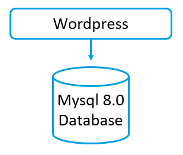

# Module 3 : Docker Avancé
## Cours Docker et Kubernetes pour Ingénieurs en Électronique
### Durée : 60 minutes

---

## Slide 1 : Module 3 - Docker Avancé 🚀

### Objectifs du module

**Ce que vous allez apprendre :**
- Créer des images personnalisées avec Dockerfile
- Optimiser la taille des images
- Utiliser Docker Compose pour applications multi-conteneurs
- Gérer les volumes et la persistance
- Bonnes pratiques de sécurité
- Publier vos images sur Docker Hub

**Format :**
- 20 min : Théorie Dockerfile et Docker Compose
- 40 min : Travaux pratiques intensifs

---

## Slide 2 : Docker Compose - Introduction 🎼

### Orchestration multi-conteneurs

**Qu'est-ce que Docker Compose ?**

Docker Compose est un outil pour définir et exécuter des applications Docker multi-conteneurs. Avec Compose, vous utilisez un fichier YAML pour configurer les services de votre application. Ensuite, avec une seule commande, vous créez et démarrez tous les services depuis votre configuration.

**Cas d'usage typique : WordPress + MySQL**

<div style="text-align: center; margin: 30px 0;">
  
</div>

**Avantages :**
- Configuration déclarative (fichier YAML)
- Gestion simplifiée de plusieurs conteneurs
- Réseaux et volumes automatiques
- Reproductibilité garantie
- Idéal pour développement et tests

---

## Slide 3 : Exercice 2 - Docker Compose 📝

### Déployer WordPress + MySQL

**Fichier docker-compose.yaml :**

```yaml
services:

  wordpress:
    image: wordpress
    restart: always
    ports:
      - 8080:80
    environment:
      WORDPRESS_DB_HOST: db
      WORDPRESS_DB_USER: exampleuser
      WORDPRESS_DB_PASSWORD: examplepass
      WORDPRESS_DB_NAME: exampledb
    volumes:
      - wordpress:/var/www/html
    networks:
     - db
  db:
    image: mysql:8.0
    restart: always
    environment:
      MYSQL_DATABASE: exampledb
      MYSQL_USER: exampleuser
      MYSQL_PASSWORD: examplepass
      MYSQL_RANDOM_ROOT_PASSWORD: '1'
    volumes:
      - db:/var/lib/mysql
    networks:
     - db
volumes:
  wordpress:
  db:

networks:
  db:
  # Specity driver options
    driver: bridge
    driver_opts:
      com.docker.network.bridge.host_binding_ipv4: "127.0.0.1"
```

**Source :** https://hub.docker.com/_/wordpress

---

## Slide 4 : Exercice 2 - Étapes 📋

### Démarrer la topologie

**1. Créer le fichier docker-compose.yaml**
```bash
# Créer un répertoire pour le projet
mkdir wordpress-app
cd wordpress-app

# Créer le fichier (copier le contenu du slide précédent)
notepad docker-compose.yaml  # Windows
nano docker-compose.yaml     # Linux/Mac
code docker-compose.yaml     # Les deux ...
```

**2. Démarrer la topologie (WordPress + MySQL)**

> ⚠️ **ATTENTION :** Bien arrêter le container utilisé en Exercice 1 : ```` docker stop some-wordpress ````

```bash
docker compose up
```

**Options utiles :**
```bash
# Mode détaché (background)
docker compose up -d

# Reconstruire les images avant de démarrer
docker compose up --build

# Voir les logs en temps réel
docker compose up --no-start && docker compose logs -f
```

**3. Accéder au site**
- Ouvrir http://localhost:8080
- Suivre l'assistant d'installation WordPress

---

## Slide 5 : Exercice 2 - Commandes Docker Compose 🔧

### Gérer votre application

**Voir les logs de la topologie :**
```bash
# Tous les services
docker compose logs

# Suivre les logs en temps réel
docker compose logs -f

# Logs d'un service spécifique
docker compose logs wordpress
docker compose logs db

# Dernières 50 lignes
docker compose logs --tail=50
```

**Lister les conteneurs :**
```bash
docker compose ps

# Sortie :
# NAME                    IMAGE              STATUS         PORTS
# wordpress-app-db-1      mysql:8.0          Up 2 minutes   3306/tcp
# wordpress-app-wordpress-1 wordpress:latest Up 2 minutes   0.0.0.0:8080->80/tcp
```

**Autres commandes utiles :**
```bash
# Arrêter les services
docker compose stop

# Démarrer les services arrêtés
docker compose start

# Redémarrer les services
docker compose restart

# Arrêter et supprimer les conteneurs
docker compose down

# Arrêter et supprimer conteneurs + volumes
docker compose down -v
```

---

## Slide 6 : Exercice 2 - Explorer le conteneur 🔍

### Trouver le fichier wp-admin.php

**Étape 1 : Identifier le service WordPress**
```bash
docker compose ps

# Noter le nom du service : wordpress
```

**Étape 2 : Entrer dans le conteneur**
```bash
docker compose exec -ti wordpress bash
```

**Étape 3 : Chercher le fichier**
```bash
# Dans le conteneur
find / -name "wp-config.php" 2>/dev/null

# Résultat attendu :
# /var/www/html/wp-config.php
```

**Étape 4 : Sortir du conteneur**
```bash
exit
```

---

## Slide 7 : Exercice 2 - Copier des fichiers 📂

### Extraire le fichier de configuration

**Utiliser docker compose cp :**

```bash
# Voir l'aide
docker compose cp --help

# Copier du conteneur vers l'hôte
docker compose cp wordpress:/var/www/html/wp-admin.php ./wp-admin.php

# Vérifier que le fichier a été copié
ls -l wp-admin.php  # Linux/Mac
dir wp-admin.php    # Windows
```

**Copier dans l'autre sens (hôte → conteneur) :**
```bash
docker compose cp ./mon-fichier.php wordpress:/var/www/html/
```

**Alternative avec docker cp :**
```bash
# Obtenir le nom complet du conteneur
docker compose ps

# Copier avec docker cp
docker cp wordpress-app-wordpress-1:/var/www/html/wp-admin.php ./
```

---

## Slide 8 : Exercice 2 - Statistiques 📊

### Vérifier les ressources utilisées

**Voir les statistiques des conteneurs :**

```bash
# Avec Docker
docker stats

# Sortie :
# CONTAINER ID   NAME                        CPU %   MEM USAGE / LIMIT
# abc123def456   wordpress-app-wordpress-1   0.5%    128MiB / 7.7GiB
# def456ghi789   wordpress-app-db-1          1.2%    256MiB / 7.7GiB
```

**Commandes utiles :**
```bash
# Stats sans streaming (une seule fois)
docker stats --no-stream

# Stats de conteneurs spécifiques
docker stats wordpress-app-wordpress-1 wordpress-app-db-1

# Format personnalisé
docker stats --format "table {{.Name}}\t{{.CPUPerc}}\t{{.MemUsage}}"
```

**Analyser :**
- Utilisation CPU
- Consommation mémoire
- I/O réseau et disque
- Identifier les conteneurs gourmands

---

## Slide 9 : Exercice 2 - Changer le port 🔌

### Modifier le port d'accès

**Objectif :** Rendre WordPress accessible sur http://localhost:9080

**Étape 1 : Arrêter les services**
```bash
docker compose down
```

**Étape 2 : Modifier docker-compose.yaml**
```yaml
services:
  wordpress:
    # ... autres configurations ...
    ports:
      - "9080:80"  # Changé de 8080 à 9080
```

**Étape 3 : Redémarrer**
```bash
docker compose up -d
```

**Étape 4 : Vérifier**
- Ouvrir http://localhost:9080
- WordPress devrait être accessible

**Note :** Le port interne (80) reste inchangé, seul le port externe change.

---

## Slide 10 : Exercice 3 - Serveur Web NGINX 🌐

### Exécution d'un serveur web basique

**Référence :** https://www.docker.com/blog/how-to-use-the-official-nginx-docker-image/

> ⚠️ **ATTENTION :** Ne pas suivre la section "Setting up a reverse proxy server" du tutoriel Docker. Concentrez-vous uniquement sur les sections de base pour cet exercice.

**Lancer NGINX :**
```bash
docker run -it --rm -d -p 8080:80 --name web nginx
```

**Explication des options :**
- `-it` : Mode interactif avec terminal
- `--rm` : Supprimer automatiquement après arrêt
- `-d` : Mode détaché (background)
- `-p 8080:80` : Mapper le port 80 du conteneur sur le port 8080 de l'hôte
- `--name web` : Nommer le conteneur "web"

**Tester :**
- Ouvrir http://localhost:8080
- Vous devriez voir la page d'accueil NGINX

**Page par défaut :**
```
Welcome to nginx!
If you see this page, the nginx web server is successfully installed and working.
```

---

## Slide 11 : Exercice 3 - HTML personnalisé 📄

### Ajouter votre propre contenu

**Arrêter le conteneur :**
```bash
docker stop web
```

**Créer un répertoire et un fichier HTML :**
```bash
# Créer le répertoire
mkdir site-content
cd site-content

# Créer index.html
echo '<!doctype html>
<html>
<head>
    <title>Mon Site</title>
</head>
<body>
    <h1>Hello du container Nginx de votre-nom !</h1>
    <p>Ceci est mon site web personnalis&eacute; !</p>
</body>
</html>' > index.html
```

**Lancer NGINX avec un volume monté :**
```bash
docker run -it --rm -d -p 8080:80 --name web \
  -v ./site-content:/usr/share/nginx/html \
  nginx
```

**Explication :**
- `-v ./site-content:/usr/share/nginx/html` : Monte le répertoire local dans le conteneur
- Le contenu de `site-content` remplace le contenu par défaut de NGINX

**Tester :**
- Ouvrir http://localhost:8080
- Vous devriez voir votre HTML personnalisé

---

## Slide 12 : Exercice 3 - Dockerfile Introduction 📝

### Construire une image personnalisée

> ⚠️ **ATTENTION :** Utiliser des fichiers locaux plutôt que votre repértoire réseau pour cet exercice, quitte à copier/coller le contenu à la fin du TP.

**Pourquoi créer un Dockerfile ?**
- Les volumes sont parfaits pour le développement local
- Pour déployer, il faut inclure les fichiers dans l'image
- Le Dockerfile permet de créer une image portable

**Créer un Dockerfile :**
```bash
cd site-content
gedit Dockerfile
```

**Contenu du Dockerfile :**
```dockerfile
FROM nginx:latest
COPY ./index.html /usr/share/nginx/html/index.html
```

**Explication ligne par ligne :**

1. `FROM nginx:latest`
   - Image de base : dernière version de NGINX
   - Télécharge l'image si elle n'existe pas localement

2. `COPY ./index.html /usr/share/nginx/html/index.html`
   - Copie le fichier local `index.html`
   - Vers le répertoire `/usr/share/nginx/html/` dans l'image
   - Écrase le fichier par défaut de NGINX

---

## Slide 13 : Exercice 3 - Build de l'image 🔨

### Construire l'image personnalisée

**Commande de build :**
```bash
docker build -t webserver .
```

**Explication :**
- `docker build` : Commande pour construire une image
- `-t webserver` : Tag (nom) de l'image
- `.` : Contexte de build (répertoire courant)

**Sortie attendue :**
```
[+] Building 2.3s (7/7) FINISHED
 => [internal] load build definition from Dockerfile
 => => transferring dockerfile: 123B
 => [internal] load .dockerignore
 => [internal] load metadata for docker.io/library/nginx:latest
 => [1/2] FROM docker.io/library/nginx:latest
 => [internal] load build context
 => => transferring context: 234B
 => [2/2] COPY ./index.html /usr/share/nginx/html/index.html
 => exporting to image
 => => exporting layers
 => => writing image sha256:abc123...
 => => naming to docker.io/library/webserver
```

**Vérifier l'image créée :**
```bash
docker images webserver

# REPOSITORY   TAG       IMAGE ID       CREATED          SIZE
# webserver    latest    abc123def456   10 seconds ago   187MB
```

---

## Slide 14 : Exercice 3 - Exécuter l'image 🚀

### Lancer le conteneur depuis votre image

**Arrêter l'ancien conteneur :**
```bash
docker stop web
```

**Lancer le nouveau conteneur :**
```bash
docker run -it --rm -d -p 8080:80 --name web webserver
```

**Différence importante :**
- Pas besoin de `-v` (volume) cette fois
- Le HTML est inclus dans l'image
- L'image est portable et peut être partagée

**Tester :**
- Ouvrir http://localhost:8080
- Votre page HTML personnalisée s'affiche

**Avantages :**
- Image autonome et portable
- Pas de dépendance externe
- Peut être déployée n'importe où
- Prête pour la production

---

## Slide 15 : Exercice 3 - Publier sur Docker Hub 📤

### Partager votre image

**Étape 1 : Se connecter à Docker Hub**
```bash
docker login

# Entrer votre nom d'utilisateur et mot de passe Docker Hub
```

**Étape 2 : Tagger l'image**
```bash
docker tag webserver <votre-utilisateur-Docker>/mywebserver

# Exemple :
# docker tag webserver jdupont/mywebserver
```

**Étape 3 : Pousser l'image**
```bash
docker push <votre-utilisateur-Docker>/mywebserver

# Exemple :
# docker push jdupont/mywebserver
```

**Sortie attendue :**
```
The push refers to repository [docker.io/jdupont/mywebserver]
abc123def456: Pushed
def456ghi789: Mounted from library/nginx
...
latest: digest: sha256:xyz789... size: 1234
```

**Étape 4 : Vérifier sur Docker Hub**
- Aller sur https://hub.docker.com/r/votre-utilisateur/mywebserver
- Votre image est maintenant publique !

---

## Slide 16 : Exercice 3 - Tester l'image partagée 🔄

### Récupérer une image d'un collègue

**Supprimer votre image locale :**
```bash
docker rmi votre-utilisateur/mywebserver
docker rmi webserver
```

**Récupérer l'image d'un collègue :**
```bash
# Demander le nom d'utilisateur d'un collègue
docker pull utilisateur-collegue/mywebserver

# Lancer le conteneur
docker run -d -p 8081:80 utilisateur-collegue/mywebserver
```

**Tester :**
- Ouvrir http://localhost:8081
- Vous voyez le site de votre collègue !

**Constats :**
- Partage facile d'applications
- Reproductibilité garantie
- Collaboration simplifiée
- Base du DevOps moderne

---

## Slide 17 : Dockerfile - Commandes principales 📚

### Instructions essentielles

| Instruction | Description | Exemple |
|-------------|-------------|---------|
| `FROM` | Image de base | `FROM node:18-alpine` |
| `WORKDIR` | Répertoire de travail | `WORKDIR /app` |
| `COPY` | Copier fichiers | `COPY . /app` |
| `ADD` | Copier + extraire archives | `ADD app.tar.gz /app` |
| `RUN` | Exécuter commande (build) | `RUN npm install` |
| `CMD` | Commande par défaut | `CMD ["node", "app.js"]` |
| `ENTRYPOINT` | Point d'entrée | `ENTRYPOINT ["python"]` |
| `ENV` | Variable d'environnement | `ENV NODE_ENV=production` |
| `EXPOSE` | Documenter port | `EXPOSE 3000` |
| `VOLUME` | Point de montage | `VOLUME /data` |
| `USER` | Utilisateur | `USER node` |
| `ARG` | Argument de build | `ARG VERSION=1.0` |

**Exemple complet :**
```dockerfile
FROM node:18-alpine
WORKDIR /app
COPY package*.json ./
RUN npm install
COPY . .
EXPOSE 3000
USER node
CMD ["node", "server.js"]
```

---

## Slide 18 : Optimisation des images 🎯

### Bonnes pratiques

**1. Utiliser des images de base légères**
```dockerfile
# ❌ Lourd (1.2 GB)
FROM ubuntu:latest

# ✅ Léger (5 MB)
FROM alpine:latest

# ✅ Optimisé pour Node.js (50 MB)
FROM node:18-alpine
```

**2. Multi-stage builds**
```dockerfile
# Stage 1: Build
FROM node:18 AS builder
WORKDIR /app
COPY package*.json ./
RUN npm install
COPY . .
RUN npm run build

# Stage 2: Production
FROM node:18-alpine
WORKDIR /app
COPY --from=builder /app/dist ./dist
COPY package*.json ./
RUN npm install --production
CMD ["node", "dist/server.js"]
```

**3. Minimiser les layers**
```dockerfile
# ❌ Plusieurs layers
RUN apt-get update
RUN apt-get install -y curl
RUN apt-get install -y git

# ✅ Un seul layer
RUN apt-get update && \
    apt-get install -y curl git && \
    rm -rf /var/lib/apt/lists/*
```

**4. Utiliser .dockerignore**
```
node_modules
npm-debug.log
.git
.env
*.md
```

---

## Slide 19 : Sécurité des images 🔒

### Bonnes pratiques de sécurité

**1. Ne pas exécuter en tant que root**
```dockerfile
FROM node:18-alpine

# Créer un utilisateur non-root
RUN addgroup -g 1001 -S nodejs && \
    adduser -S nodejs -u 1001

# Changer de propriétaire
COPY --chown=nodejs:nodejs . /app

# Utiliser l'utilisateur non-root
USER nodejs

CMD ["node", "server.js"]
```

**2. Scanner les vulnérabilités**
```bash
# Avec Docker Scout (intégré)
docker scout cves nginx:latest

# Avec Trivy
trivy image nginx:latest
```

**3. Utiliser des versions spécifiques**
```dockerfile
# ❌ Version flottante
FROM node:latest

# ✅ Version fixe
FROM node:18.19.0-alpine3.19
```

**4. Minimiser les privilèges**
```dockerfile
# Copier seulement ce qui est nécessaire
COPY --chown=nodejs:nodejs package*.json ./
COPY --chown=nodejs:nodejs src/ ./src/

# Pas de COPY . . qui copie tout
```

**5. Ne jamais inclure de secrets**
```dockerfile
# ❌ JAMAIS faire ça
ENV API_KEY=secret123
ENV DB_PASSWORD=password

# ✅ Utiliser des secrets Docker ou variables d'environnement au runtime
```

---

## Slide 20 : Docker Compose avancé 🎼

### Fonctionnalités avancées

**Variables d'environnement avec fichier .env :**

```bash
# Fichier .env
MYSQL_ROOT_PASSWORD=secret123
WORDPRESS_VERSION=6.4
```

```yaml
# docker-compose.yaml
services:
  wordpress:
    image: wordpress:${WORDPRESS_VERSION}
    environment:
      WORDPRESS_DB_PASSWORD: ${MYSQL_ROOT_PASSWORD}
```

**Dépendances et healthchecks :**
```yaml
services:
  db:
    image: mysql:8.0
    healthcheck:
      test: ["CMD", "mysqladmin", "ping", "-h", "localhost"]
      interval: 10s
      timeout: 5s
      retries: 5

  wordpress:
    depends_on:
      db:
        condition: service_healthy
```

**Réseaux personnalisés :**
```yaml
services:
  frontend:
    networks:
      - frontend-net
  
  backend:
    networks:
      - frontend-net
      - backend-net

networks:
  frontend-net:
  backend-net:
```

---

## Slide 21 : Récapitulatif Module 3 📋

### Ce que nous avons appris

✅ **Docker Compose**
- Configuration multi-conteneurs avec YAML
- Commandes : up, down, logs, ps, exec
- Gestion des volumes et réseaux

✅ **Dockerfile**
- Création d'images personnalisées
- Instructions principales (FROM, COPY, RUN, CMD)
- Build et tag d'images

✅ **Optimisation**
- Images légères (Alpine)
- Multi-stage builds
- Réduction des layers

✅ **Sécurité**
- Utilisateurs non-root
- Scan de vulnérabilités
- Versions spécifiques

✅ **Partage**
- Publication sur Docker Hub
- Collaboration entre équipes

---

## Slide 22 : Questions ? 🙋

### Discussion

**Points à clarifier ?**
- Dockerfile pas clair ?
- Problèmes avec Docker Compose ?
- Questions sur l'optimisation ?

**Prochaine étape :**
Module 4 - Introduction à Kubernetes

---

## Slide 23 : Pause ☕

### Pause de 15 minutes

**Avant de continuer :**
- Assurez-vous d'avoir réussi les exercices
- Votre image est-elle sur Docker Hub ?
- Testez les commandes Docker Compose

**Prochaine étape :**
Kubernetes - L'orchestration à grande échelle !

**Rendez-vous dans 15 minutes ! 🚀**

---

## Notes pour le formateur 👨‍🏫

### Timing suggéré
- Slides 1-9 : Docker Compose (25 min)
- Slides 10-16 : Dockerfile et build (25 min)
- Slides 17-21 : Optimisation et sécurité (10 min)

### Points d'attention
- Vérifier que docker-compose.yaml est correct
- Aider au dépannage des problèmes de build
- S'assurer que tout le monde peut publier sur Docker Hub
- Encourager l'expérimentation

### Problèmes courants
- Erreurs de syntaxe YAML (indentation)
- Port déjà utilisé
- Problèmes de permissions sur les volumes
- Échec de connexion à Docker Hub

### Exercices bonus
- Créer un Dockerfile pour une application Python
- Ajouter un service Redis à docker-compose.yaml
- Optimiser une image existante
