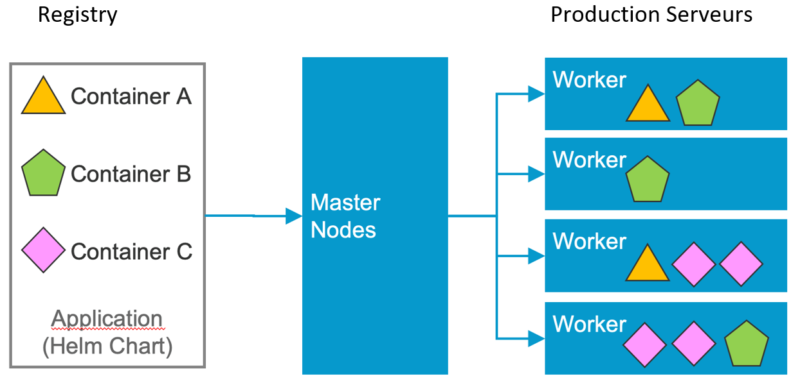
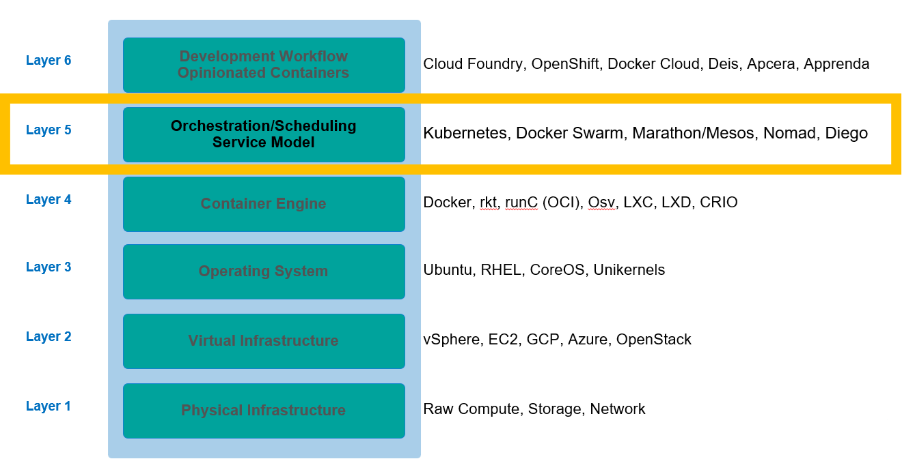
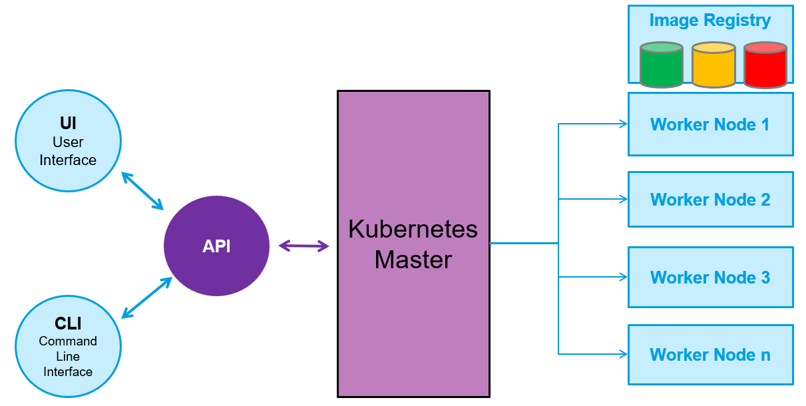
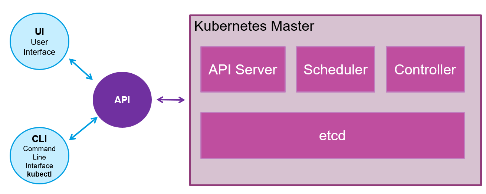
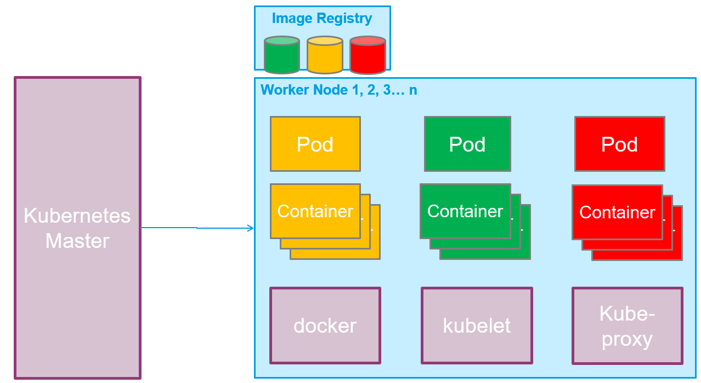
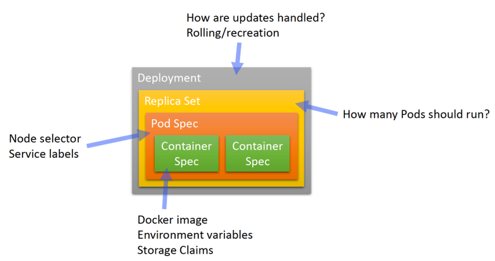

# Module 4 : Introduction à Kubernetes
## Cours Docker et Kubernetes pour Ingénieurs en Électronique
### Durée : 60 minutes

---

## Slide 1 : Module 4 - Kubernetes ☸️

### Objectifs du module

**Ce que vous allez apprendre :**
- Comprendre la problématique de l'orchestration
- Architecture et concepts de Kubernetes
- Composants principaux : Pods, Deployments, Services
- Utiliser kubectl (interface en ligne de commande)
- Déployer une application sur Kubernetes
- Concepts de scalabilité et haute disponibilité

**Format :**
- 30 min : Théorie et concepts
- 30 min : Démonstration et exercices

---

## Slide 2 : Problématique de l'Orchestration 🤔

### Du développement à la production

**Scénario :**
Vous avez créé une application avec Docker. Elle fonctionne parfaitement en local.

**Mais en production, vous devez gérer :**
- 🔄 **Scalabilité** : Augmenter/diminuer le nombre d'instances
- 🏥 **Haute disponibilité** : Redémarrer automatiquement les conteneurs défaillants
- ⚖️ **Load balancing** : Répartir la charge entre instances
- 🔄 **Rolling updates** : Mettre à jour sans interruption
- 🔙 **Rollback** : Revenir à une version précédente
- 📊 **Monitoring** : Surveiller l'état des applications
- 🌐 **Service discovery** : Permettre aux services de se trouver
- 💾 **Gestion du stockage** : Volumes persistants
- 🔐 **Secrets** : Gérer les données sensibles

**Docker seul ne suffit pas pour gérer tout cela à grande échelle !**

<div style="text-align: center; margin: 30px 0;">
  
</div>

---

## Slide 3 : Container Orchestration 🎼

### Les couches d'infrastructure

**Stack technologique moderne :**

<div style="text-align: center; margin: 30px 0;">
  
</div>

**Kubernetes se situe à la couche 5 : Orchestration**

**Comment Kubernetes orchestre les conteneurs :**
- **Registry** : Stocke les images des applications (Container A, B, C)
- **Master Nodes** : Contrôle et planifie le déploiement des conteneurs
- **Worker Nodes** : Serveurs de production qui exécutent les conteneurs
- **Distribution intelligente** : Les conteneurs sont répartis automatiquement sur les workers selon les besoins

---

## Slide 4 : Qu'est-ce que Kubernetes ? ☸️

### La plateforme d'orchestration de conteneurs

**Définition officielle :**
Kubernetes est une plateforme open-source pour automatiser le déploiement, la mise à l'échelle et les opérations des conteneurs d'applications sur des clusters d'hôtes, fournissant une infrastructure centrée sur les conteneurs.

**Caractéristiques clés :**

✅ **Orchestrateur de conteneurs**
- Exécute et gère des conteneurs à grande échelle

✅ **Support multi-environnements**
- Cloud public, privé, hybride, bare-metal

✅ **Inspiré par Google**
- Basé sur 15 ans d'expérience avec Borg et Omega
- Gère des milliards de conteneurs par semaine

✅ **100% Open Source**
- Écrit en Go
- Communauté active (CNCF)

✅ **Gestion d'applications, pas de machines**
- Abstraction de l'infrastructure
- Focus sur les applications

✅ **Écosystème riche**
- Plugins pour scheduling, storage, networking

---

## Slide 5 : Que fait Kubernetes ? 🛠️

### Fonctionnalités principales

**1. Runtime pour conteneurs Docker**
- Exécute vos conteneurs Docker
- Gère leur cycle de vie

**2. Scalabilité et load balancing**
- Augmente/diminue automatiquement le nombre de conteneurs
- Répartit la charge entre les instances

**3. Abstraction de l'infrastructure**
- Les conteneurs peuvent tourner n'importe où
- Pas besoin de savoir sur quel serveur

**4. Monitoring et health checks**
- Surveille l'état des conteneurs
- Redémarre automatiquement en cas de problème

**5. Définition déclarative**
- Vous décrivez l'état désiré
- Kubernetes s'occupe de l'atteindre

**6. Mises à jour et rollbacks**
- Rolling updates sans interruption
- Retour arrière facile

**7. Gestion du stockage**
- Montage de volumes
- Abstraction du stockage sous-jacent

**8. Service discovery et exposition**
- Les services se trouvent automatiquement
- Exposition interne et externe

**9. Labelling et sélection**
- Organisation flexible des ressources
- Requêtes puissantes

---

## Slide 6 : Terminologie Kubernetes - Nodes 🖥️

### Les machines du cluster

**Node (Nœud)**
- Hôte qui exécute les applications Kubernetes
- Peut être physique ou virtuel

**Master Node (Nœud maître)**
- Contrôle et gère le cluster
- Composants :
  - **kubectl** : Client en ligne de commande
  - **REST API** : Communication avec les workers
  - **Scheduler** : Logique de planification et réplication
- Généralement 2+ master nodes pour la résilience
- Ne sont PAS utilisés pour scaler le cluster

**Worker Node (Nœud de travail)**
- Nœud qui héberge les services Kubernetes
- Composants :
  - **kubelet** : Agent K8s qui accepte les commandes du master
  - **kube-proxy** : Proxy réseau au niveau du nœud
  - Responsable du routage du trafic entrant (ingress)
- **Docker host** : Exécute les conteneurs

<div style="text-align: center; margin: 30px 0;">
  
</div>

<div style="text-align: center; margin: 30px 0;">
  
</div>

<div style="text-align: center; margin: 30px 0;">
  
</div>

---

## Slide 7 : Terminologie Kubernetes - Pods 📦

### L'unité de base

**Pod**
- Plus petite unité déployable dans Kubernetes
- Collection de conteneurs qui s'exécutent sur un worker node
- Un pod peut contenir un ou plusieurs conteneurs
- Chaque pod a sa propre adresse IP
- Les conteneurs d'un pod partagent :
  - Namespace PID
  - Réseau
  - Hostname
  - Volumes

**Caractéristiques :**
- Éphémère (mortel)
- Peut être recréé automatiquement
- IP peut changer à chaque recréation

```
┌─────────────────────────────┐
│          Pod                │
│  IP: 10.244.1.5             │
│  ┌──────────┐  ┌──────────┐ │
│  │Container │  │Container │ │
│  │   App    │  │  Sidecar │ │
│  └──────────┘  └──────────┘ │
│  Shared: Network, Storage   │
└─────────────────────────────┘
```

**Exemple typique :**
- Conteneur principal : Application web
- Conteneur sidecar : Agent de logs

---

## Slide 8 : Terminologie Kubernetes - Autres concepts 🔑

### Composants essentiels

**Replication Controller / ReplicaSet**
- Assure la disponibilité et la scalabilité
- Maintient le nombre de pods demandé par l'utilisateur
- Utilise un template décrivant ce que chaque pod doit contenir

**Labels (Étiquettes)**
- Métadonnées assignées aux ressources K8s (pods, services)
- Paires clé-valeur pour l'identification
- Critiques pour K8s : requêtes basées sur les labels

**Services**
- Collection de pods exposés comme un endpoint
- Informations stockées dans l'état du cluster
- Informations réseau propagées à tous les worker nodes
- Fournit une IP stable et un DNS

**Secrets**
- Informations sensibles que les conteneurs doivent lire
- Volumes spéciaux montés automatiquement
- Chaque entrée a son propre chemin

**Proxy**
- Load balancer pour les pods
- Répartit le trafic

**etcd**
- Service de métadonnées
- Base de données backend distribuée
- Stocke l'état du cluster

<div style="text-align: center; margin: 30px 0;">
  
</div>

---

## Slide 9 : Architecture Kubernetes - Vue d'ensemble 🏗️

### Architecture complète

```
┌──────────────────────────────────────────────────────┐
│                    Utilisateurs                      │
│  ┌──────────┐  ┌──────────┐  ┌──────────┐            │
│  │    UI    │  │   CLI    │  │   API    │            │
│  │Interface │  │ kubectl  │  │  Calls   │            │
│  └──────────┘  └──────────┘  └──────────┘            │
└────────────────────┬─────────────────────────────────┘
                     │
┌────────────────────▼─────────────────────────────────┐
│              Kubernetes Master                       │
│  ┌──────────────────────────────────────────────┐    │
│  │  API Server                                  │    │
│  ├──────────────────────────────────────────────┤    │
│  │  Scheduler                                   │    │
│  ├──────────────────────────────────────────────┤    │
│  │  Controller Manager                          │    │
│  ├──────────────────────────────────────────────┤    │
│  │  etcd (Cluster State)                        │    │
│  └──────────────────────────────────────────────┘    │
└────────────────────┬─────────────────────────────────┘
                     │
        ┌────────────┼────────────┬────────────┐
        │            │            │            │
┌───────▼──────┐┌────▼──────┐┌────▼───────┐┌───▼────────┐
│  Worker 1    ││ Worker 2  ││ Worker 3   ││ Worker n   │
│ ┌──────────┐ ││┌──────────┐│┌──────────┐││┌──────────┐│
│ │  kubelet │ │││  kubelet │││  kubelet │││|  kubelet ││
│ │kube-proxy│ │││kube-proxy│││kube-proxy│││|kube-proxy││
│ └──────────┘ ││└──────────┘│└──────────┘││└──────────┘│
│ ┌──────────┐ ││┌──────────┐│┌──────────┐││┌──────────┐│
│ │   Pod    │ │││   Pod    │││   Pod    │││|   Pod    ││
│ │┌────────┐│ │││┌────────┐│││┌────────┐│││|┌────────┐││
│ ││Containr││ │││|Containr││││|Containr││││||Containr│││
│ │└────────┘│ │││└────────┘│││└────────┘│││|└────────┘││
│ └──────────┘ ││└──────────┘│└──────────┘││└──────────┘│
└──────────────┘└───────────┘└───────────┘└─────────────┘
        │            │             │            │
        └────────────┴─────────────┴────────────┘
                     │
            ┌────────▼────────┐
            │  Image Registry │
            │   (Docker Hub)  │
            └─────────────────┘
```

---

## Slide 10 : Concepts Kubernetes - Deployment, Replica, Pod 📊

### Hiérarchie des objets

```
┌────────────────────────────────────────────┐
│            Deployment                      │
│  Gère les ReplicaSets et les mises à jour  │
│                                            │
│  ┌───────────────────────────────────────┐ │
│  │         ReplicaSet                    │ │
│  │  Maintient 3 réplicas du Pod          │ │
│  │                                       │ │
│  │  ┌─────────┐  ┌─────────┐  ┌─────────┐│ │
│  │  │  Pod 1  │  │  Pod 2  │  │  Pod 3  ││ │
│  │  │┌───────┐│  │┌───────┐│  │┌───────┐││ │
│  │  ││ nginx ││  ││ nginx ││  ││ nginx │││ │
│  │  │└───────┘│  │└───────┘│  │└───────┘││ │
│  │  └─────────┘  └─────────┘  └─────────┘│ │
│  └───────────────────────────────────────┘ │
└────────────────────────────────────────────┘
```

**Relations :**
1. **Deployment** → Gère les ReplicaSets
2. **ReplicaSet** → Maintient le nombre de Pods
3. **Pod** → Exécute les conteneurs

---

## Slide 11 : Récapitulatif des concepts 📝

### Points clés à retenir

**Container Image (Image de conteneur)**
- Image Docker contenant votre code applicatif
- Environnement isolé

**Pod**
- Unité de gestion dans Kubernetes
- Composé d'un ou plusieurs conteneurs
- Possède sa propre IP et namespaces de stockage
- Tous les conteneurs partagent réseau et stockage

**Deployment**
- Nouvelle façon de gérer la Haute Disponibilité (HA)
- Remplace le Replication Controller
- Un pod seul est "mortel"
- Avec un Deployment, K8s garantit que le nombre spécifié de pods est toujours actif
- Définit combien d'instances d'un pod vont tourner
- Défini par un fichier YAML

**Service**
- Abstraction définissant un ensemble logique de Pods
- Politique d'accès aux pods (micro-service)
- Mode Cluster IP : interne à Kubernetes
- Mode NodePorts : IP publiées pour accès externe
- Routes basées sur les labels
- Défini par un fichier YAML

---

## Slide 12 : kubectl - L'outil en ligne de commande 🔧

### Interface avec Kubernetes

**kubectl** est l'outil CLI pour interagir avec Kubernetes

**Commandes essentielles :**

```bash
# Obtenir des informations
kubectl get pods                    # Lister les pods
kubectl get deployments            # Lister les deployments
kubectl get services               # Lister les services
kubectl get nodes                  # Lister les nœuds

# Décrire des ressources
kubectl describe pod mon-pod       # Détails d'un pod
kubectl describe deployment app    # Détails d'un deployment

# Créer des ressources
kubectl create -f deployment.yaml  # Créer depuis un fichier
kubectl apply -f deployment.yaml   # Créer ou mettre à jour

# Supprimer des ressources
kubectl delete pod mon-pod         # Supprimer un pod
kubectl delete -f deployment.yaml  # Supprimer depuis un fichier

# Logs et débogage
kubectl logs mon-pod               # Voir les logs
kubectl logs -f mon-pod            # Suivre les logs
kubectl exec -it mon-pod -- bash   # Shell dans un pod

# Scaling
kubectl scale deployment app --replicas=5  # Scaler à 5 réplicas
```

---

## Slide 13 : Exemple de Deployment YAML 📄

### Définir un déploiement

```yaml
apiVersion: apps/v1
kind: Deployment
metadata:
  name: nginx-deployment
  labels:
    app: nginx
spec:
  replicas: 3
  selector:
    matchLabels:
      app: nginx
  template:
    metadata:
      labels:
        app: nginx
    spec:
      containers:
      - name: nginx
        image: nginx:1.25
        ports:
        - containerPort: 80
        resources:
          limits:
            memory: "128Mi"
            cpu: "500m"
```

**Explication :**
- `replicas: 3` : 3 instances du pod
- `selector` : Sélectionne les pods avec le label `app: nginx`
- `template` : Template du pod à créer
- `containers` : Liste des conteneurs dans le pod
- `resources` : Limites de ressources

**Déployer :**
```bash
kubectl apply -f nginx-deployment.yaml
```

---

## Slide 14 : Exemple de Service YAML 🌐

### Exposer un déploiement

```yaml
apiVersion: v1
kind: Service
metadata:
  name: nginx-service
spec:
  type: LoadBalancer
  selector:
    app: nginx
  ports:
    - protocol: TCP
      port: 80
      targetPort: 80
      nodePort: 30080
```

**Types de services :**

1. **ClusterIP** (défaut)
   - IP interne au cluster
   - Accessible uniquement depuis le cluster

2. **NodePort**
   - Expose le service sur un port de chaque nœud
   - Accessible depuis l'extérieur via `<NodeIP>:<NodePort>`

3. **LoadBalancer**
   - Crée un load balancer externe (cloud)
   - Distribue le trafic entre les pods

4. **ExternalName**
   - Mappe le service à un nom DNS externe

**Créer le service :**
```bash
kubectl apply -f nginx-service.yaml
```

---

## Slide 15 : Workflow complet 🔄

### Du code à la production

**1. Développement**
```bash
# Créer votre application
# Créer un Dockerfile
# Construire l'image
docker build -t myapp:v1 .

# Pousser sur un registre
docker push myregistry/myapp:v1
```

**2. Définir les ressources Kubernetes**
```yaml
# deployment.yaml
apiVersion: apps/v1
kind: Deployment
metadata:
  name: myapp
spec:
  replicas: 3
  selector:
    matchLabels:
      app: myapp
  template:
    metadata:
      labels:
        app: myapp
    spec:
      containers:
      - name: myapp
        image: myregistry/myapp:v1
        ports:
        - containerPort: 8080
```

**3. Déployer**
```bash
kubectl apply -f deployment.yaml
kubectl apply -f service.yaml
```

**4. Vérifier**
```bash
kubectl get pods
kubectl get services
kubectl logs <pod-name>
```

**5. Mettre à jour**
```bash
# Nouvelle version
docker build -t myapp:v2 .
docker push myregistry/myapp:v2

# Mettre à jour le deployment
kubectl set image deployment/myapp myapp=myregistry/myapp:v2

# Ou modifier le YAML et réappliquer
kubectl apply -f deployment.yaml
```

---

## Slide 16 : Scalabilité avec Kubernetes ⚖️

### Adapter la capacité

**Scaling manuel :**
```bash
# Augmenter à 5 réplicas
kubectl scale deployment nginx-deployment --replicas=5

# Vérifier
kubectl get pods
```

**Horizontal Pod Autoscaler (HPA) :**
```yaml
apiVersion: autoscaling/v2
kind: HorizontalPodAutoscaler
metadata:
  name: nginx-hpa
spec:
  scaleTargetRef:
    apiVersion: apps/v1
    kind: Deployment
    name: nginx-deployment
  minReplicas: 2
  maxReplicas: 10
  metrics:
  - type: Resource
    resource:
      name: cpu
      target:
        type: Utilization
        averageUtilization: 70
```

**Comportement :**
- Minimum 2 pods
- Maximum 10 pods
- Scale automatiquement si CPU > 70%

**Créer l'autoscaler :**
```bash
kubectl apply -f hpa.yaml
kubectl get hpa
```

---

## Slide 17 : Rolling Updates et Rollbacks 🔄

### Mises à jour sans interruption

**Rolling Update automatique :**
```bash
# Mettre à jour l'image
kubectl set image deployment/nginx-deployment nginx=nginx:1.26

# Suivre le déploiement
kubectl rollout status deployment/nginx-deployment
```

**Stratégie de déploiement :**
```yaml
spec:
  strategy:
    type: RollingUpdate
    rollingUpdate:
      maxSurge: 1        # Pods supplémentaires pendant la mise à jour
      maxUnavailable: 0  # Pods indisponibles pendant la mise à jour
```

**Rollback en cas de problème :**
```bash
# Voir l'historique
kubectl rollout history deployment/nginx-deployment

# Revenir à la version précédente
kubectl rollout undo deployment/nginx-deployment

# Revenir à une version spécifique
kubectl rollout undo deployment/nginx-deployment --to-revision=2
```

**Pause/Resume :**
```bash
# Mettre en pause
kubectl rollout pause deployment/nginx-deployment

# Reprendre
kubectl rollout resume deployment/nginx-deployment
```

---

## Slide 18 : Outils et environnements de test 🧪

### Apprendre Kubernetes

**1. Minikube**
- Kubernetes local sur votre machine
- Parfait pour le développement
- Installation : https://minikube.sigs.k8s.io/

```bash
# Démarrer Minikube
minikube start

# Utiliser kubectl
kubectl get nodes
```

**2. Kind (Kubernetes in Docker)**
- Cluster K8s dans des conteneurs Docker
- Léger et rapide
- https://kind.sigs.k8s.io/

**3. K3s**
- Kubernetes léger pour IoT et Edge
- Parfait pour Raspberry Pi
- https://k3s.io/

**4. Play with Kubernetes**
- Environnement en ligne gratuit
- https://labs.play-with-k8s.com/
- Pas d'installation nécessaire

**5. Cloud providers**
- Google Kubernetes Engine (GKE)
- Amazon Elastic Kubernetes Service (EKS)
- Azure Kubernetes Service (AKS)
- Offres gratuites disponibles

---

## Slide 19 : Démonstration 🎬

### Déployer une application

**Scénario : Déployer NGINX sur Kubernetes**

```bash
# 1. Créer un deployment
kubectl create deployment nginx --image=nginx:latest

# 2. Vérifier les pods
kubectl get pods

# 3. Exposer le deployment
kubectl expose deployment nginx --port=80 --type=NodePort

# 4. Obtenir l'URL du service
kubectl get services

# 5. Scaler l'application
kubectl scale deployment nginx --replicas=3

# 6. Vérifier les réplicas
kubectl get pods

# 7. Voir les détails
kubectl describe deployment nginx

# 8. Voir les logs
kubectl logs <pod-name>

# 9. Nettoyer
kubectl delete service nginx
kubectl delete deployment nginx
```

---

## Slide 20 : Kubernetes vs Docker Compose 🆚

### Quand utiliser quoi ?

| Critère | Docker Compose | Kubernetes |
|---------|----------------|------------|
| **Complexité** | Simple | Complexe |
| **Cas d'usage** | Développement local | Production |
| **Scalabilité** | Limitée | Illimitée |
| **Haute disponibilité** | Non | Oui |
| **Multi-hôtes** | Non | Oui |
| **Auto-healing** | Non | Oui |
| **Load balancing** | Basique | Avancé |
| **Rolling updates** | Non | Oui |
| **Courbe d'apprentissage** | Faible | Élevée |

**Recommandation :**
- **Développement** : Docker Compose
- **Production** : Kubernetes
- **Transition** : Kompose (convertit docker-compose.yaml en K8s)

---

## Slide 21 : Ressources pour aller plus loin 📚

### Continuer l'apprentissage

**Documentation officielle :**
- https://kubernetes.io/fr/docs/home/
- Tutoriels interactifs
- Guides de référence

**Formations gratuites :**
- **IBM SkillsBuild** : https://skillsbuild.org
  - Parcours Cloud
  - Certificats numériques gratuits
  - Niveaux : Fondamentaux (5h), Intermédiaire (10h+), Avancé (20h+)

**Certifications :**
- CKA (Certified Kubernetes Administrator)
- CKAD (Certified Kubernetes Application Developer)
- CKS (Certified Kubernetes Security Specialist)

**Livres recommandés :**
- "Kubernetes Up & Running" - Kelsey Hightower
- "The Kubernetes Book" - Nigel Poulton

**Communautés :**
- Kubernetes Slack
- CNCF (Cloud Native Computing Foundation)
- Meetups locaux

---

## Slide 22 : IBM SkillsBuild 🎓

### Acquérir des compétences essentielles

**4 parcours pédagogiques gratuits :**
- 🔬 **Data Science**
- 🤖 **AI (Intelligence Artificielle)**
- ☁️ **Cloud**
- 🔒 **Security**

**3 niveaux de certificats numériques :**
1. **Fondamentaux** (5h)
2. **Intermédiaire** (10h+)
3. **Avancé** (20h+)

**Processus :**
```
Formation → Monter en compétence
    ↓
Validation → Certificat numérique
    ↓
Mise en valeur → Enrichir CV et LinkedIn
```

**Visitez : https://skillsbuild.org**

---

## Slide 23 : Récapitulatif du cours complet 📋

### Ce que vous avez appris aujourd'hui

**Module 1 : Introduction**
- Concepts de conteneurisation
- Docker vs VMs
- Architecture Docker

**Module 2 : Docker Essentiels**
- Commandes de base
- Gestion des conteneurs
- Images et registres

**Module 3 : Docker Avancé**
- Dockerfile et build d'images
- Docker Compose
- Optimisation et sécurité

**Module 4 : Kubernetes**
- Orchestration de conteneurs
- Architecture K8s
- Déploiements et services
- Scalabilité et HA

**Vous êtes maintenant prêts à :**
- Conteneuriser vos applications
- Déployer avec Docker Compose
- Comprendre Kubernetes
- Continuer votre apprentissage

---

## Slide 24 : Questions finales ? 🙋

### Discussion et feedback

**Points à clarifier ?**
- Concepts pas clairs ?
- Questions sur les cas d'usage ?
- Conseils pour continuer ?

**Feedback :**
- Qu'avez-vous appris ?
- Qu'allez-vous utiliser ?
- Suggestions d'amélioration ?

---

## Slide 25 : Merci ! 🎉

### Thank You!

**Vos formateurs :**
- Laurent Grateau - laurent.grateau@fr.ibm.com
- Nicolas Peulvast - peulvast@fr.ibm.com

**Ressources :**
- Documentation du cours : [lien vers le repo Git]
- Docker Hub : https://hub.docker.com/
- Kubernetes : https://kubernetes.io/
- IBM SkillsBuild : https://skillsbuild.org

**Continuez à pratiquer !**
- Créez vos propres images Docker
- Déployez des applications
- Explorez Kubernetes
- Partagez vos projets

**Bon courage dans vos projets ! 🚀**

---

## Notes pour le formateur 👨‍🏫

### Timing suggéré
- Slides 1-11 : Concepts et architecture (25 min)
- Slides 12-17 : kubectl et déploiements (20 min)
- Slides 18-19 : Démonstration (10 min)
- Slides 20-25 : Conclusion et ressources (5 min)

### Points d'attention
- Adapter selon le niveau des étudiants
- Privilégier la démonstration à la théorie
- Encourager les questions
- Partager des exemples concrets

### Démonstration recommandée
- Utiliser Minikube ou Play with K8s
- Déployer une application simple (nginx)
- Montrer le scaling en temps réel
- Démontrer un rolling update

### Exercices bonus
- Déployer WordPress sur Kubernetes
- Créer un HPA
- Configurer un Ingress
- Utiliser des ConfigMaps et Secrets